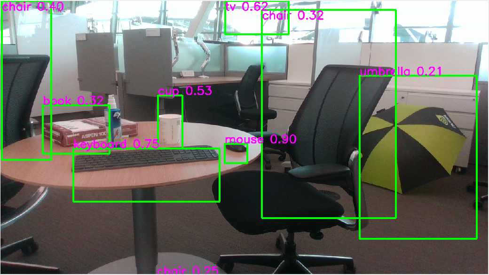
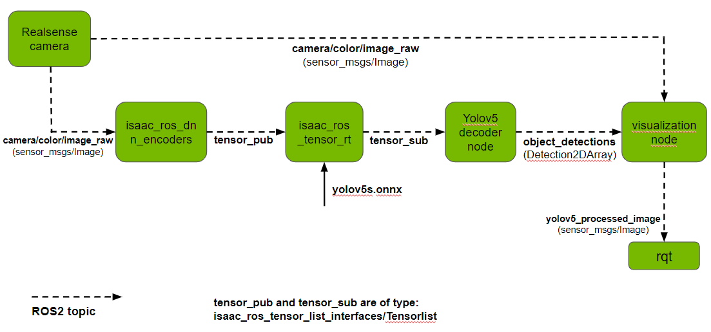

# YOLOv5 object detection with Isaac ROS

This is a sample showing how to integrate YOLOv5 with Nvidia [Isaac ROS DNN Inference](https://github.com/NVIDIA-ISAAC-ROS/isaac_ros_dnn_inference).

<p align="center" width="100%">

</p>

## Requirements

Tested on Jetson Orin running JetPack 5.0.2 and Intel RealSense D435 Webcam.
- [ROS2 Humble](https://docs.ros.org/en/humble/index.html)

## Development Environment Setup

Use the [Isaac ROS Dev Docker](https://github.com/NVIDIA-ISAAC-ROS/isaac_ros_dnn_inference#docker) for development. This provides an environment with all dependencies installed to run [Isaac ROS](https://github.com/NVIDIA-ISAAC-ROS) packages. 

## Usage 

Refer to the license terms for the YOLOv5 project before using this software and ensure you are using YOLOv5 under license terms compatible with your project requirements.

### Model preparation
- Download the YOLOv5 PyTorch model - [yolov5s.pt](https://github.com/ultralytics/yolov5/releases/download/v6.2/yolov5s.pt) from the [Ultralytics YOLOv5](https://github.com/ultralytics/yolov5) project.
- Export to ONNX following steps [here](https://github.com/ultralytics/yolov5/issues/251) and visualize the ONNX model using [Netron](https://netron.app/). Note `input` and `output` names - these will be used to run the node. For instance, `images` for input and `output0` for output.
- Copy the ONNX model to a location accessible from the container.

### Object Detection pipeline Setup
- Following the development environment setup above, you should have a ROS2 workspace named `workspaces/isaac_ros-dev`. Clone this repository and its dependencies under `workspaces/isaac_ros-dev/src`:
```
cd ~/workspaces/isaac_ros-dev/src
git clone https://github.com/NVIDIA-ISAAC-ROS/isaac_ros_common.git
git clone https://github.com/NVIDIA-ISAAC-ROS/isaac_ros_nitros.git
git clone https://github.com/NVIDIA-ISAAC-ROS/isaac_ros_dnn_inference.git
git clone https://github.com/NVIDIA-ISAAC-ROS/isaac_ros_image_pipeline
git clone https://github.com/NVIDIA-AI-IOT/YOLOv5-with-Isaac-ROS.git
```
- Download [requirements.txt](https://github.com/ultralytics/yolov5/blob/master/requirements.txt) from the Ultralytics YOLOv5 project to `workspaces/isaac_ros-dev/src`.
- Launch the Docker container using the run_dev.sh script:
```
cd ~/workspaces/isaac_ros-dev/src/isaac_ros_common
./scripts/run_dev.sh
```
- Inside the container, run the following: 
```
pip install -r src/requirements.txt
```
This project runs on a device with an Nvidia GPU. The Isaac ROS Dev container uses the Nvidia-built PyTorch version with CUDA-acceleration. Ensure that you install a compatible Torchvision version from source for CUDA-acceleration. Specify the compatible version in place of `$torchvision_tag` below:
```
git clone https://github.com/pytorch/vision.git
cd vision
git checkout $torchvision_tag
pip install -v .
```
- Download the [utils](https://github.com/ultralytics/yolov5/tree/master/utils) folder from the Ultralytics YOLOv5 project and put it in the `yolov5_isaac_ros` folder of this repository.
- Finally, your file structure should look like this (not showing all files here):
```
.
+- workspaces
   +- isaac_ros-dev
      +- src
         +- requirements.txt
         +- yolov5s.onnx
         +- isaac_ros_common
         +- yolov5-isaac-ros-dnn
            +- README
            +- launch
            +- images
            +- yolov5_isaac_ros
               +- utils
               +- Yolov5Decoder.py  
               +- Yolov5DecoderUtils.py    
```
Refer to the license terms for the YOLOv5 project before using this software and ensure you are using YOLOv5 under license terms compatible with your project requirements.

<p align="center" width="100%">

</p>

### Running the pipeline
- Follow [Isaac ROS Realsense Setup](https://github.com/NVIDIA-ISAAC-ROS/.github/blob/main/profile/realsense-setup.md) to setup the camera.
- Inside the container, build and source the workspace:
```
cd /workspaces/isaac_ros-dev
colcon build --symlink-install
source install/setup.bash
```
- Launch the RealSense camera node (confirm you've completed all the steps [here](https://github.com/NVIDIA-ISAAC-ROS/isaac_ros_image_pipeline#quickstart)):
`ros2 launch realsense2_camera rs_launch.py`
- Verify that images are being published on `/camera/color/image_raw`. You could use RQt for this or use this command in another terminal inside the container:
`ros2 topic echo /camera/color/image_raw`
- In another terminal inside the container, run the `yolov5_isaac_ros` node. This subscribes to input images from the RealSense camera on topic `/camera/color/image_raw`. It performs inference and publishes results on topic `/object_detections` as [Detection2DArray](http://docs.ros.org/en/lunar/api/vision_msgs/html/msg/Detection2DArray.html) messages. Use the names noted above in `Model preparation` as `input_binding_names` and `output_binding_names` (for example, `images` for input and `output0` for output). Similarly, use the input dimensions noted above as `network_image_width` and `network_image_height`:
```
ros2 launch yolov5_isaac_ros isaac_ros_yolov5_tensor_rt.launch.py model_file_path:=/workspaces/isaac_ros-dev/src/yolov5s.onnx engine_file_path:=/workspaces/isaac_ros-dev/src/yolov5s.plan input_binding_names:=['images'] output_binding_names:=['output0'] network_image_width:=640 network_image_height:=640
```
- For subsequent runs, use the following command as the engine file `yolov5s.plan` is saved after the first run:
```
ros2 launch yolov5_isaac_ros isaac_ros_yolov5_tensor_rt.launch.py network_image_width:=640 network_image_height:=640 engine_file_path:=/workspaces/isaac_ros-dev/src/yolov5s.plan input_binding_names:=['images'] output_binding_names:=['output0']
```

## Using Triton
<figure>
   
   <figcaption>Workflow</figcaption>
</figure>

- Convert the ONNX model to a TRT plan file (named `model.plan`) using `trtexec`. To do this, run the following command from `/usr/src/tensorrt/bin` and save the generated file under `yolov5/1/`. 
```
./trtexec --onnx=yolov5s.onnx --saveEngine=model.plan  --fp16
```
- File structure should look like this:
```
.
+- yolov5_isaac_ros
   +- config
   +- yolov5
      +- config.pbtxt
      +- 1
         +- model.plan
   +- launch
      +- isaac_ros_yolov5_triton.launch.py
      
```
- To launch the pipeline using Triton for inference: 
```
ros2 launch yolov5_isaac_ros isaac_ros_yolov5_triton.launch.py network_image_width:=640 network_image_height:=640
```

### Output visualization
The `yolov5_visualizer_node` subscribes to the topics below and publishes images with resulting bounding boxes on topic `yolov5_processed_image`:
- `camera/color/image_raw`
- `object_detections`

On running the pipeline, an RQt window will pop up showing bounding boxes, object labels and detection scores around detected objects.

## Modifying detection parameters
Parameters like the confidence threshold can be specified in the params file `decoder_params.yaml` under the `yolov5-isaac-ros-dnn/config` folder. Below is a description of each parameter:
- conf_thres: Detection confidence threshold.
- iou_thres: IOU threshold.
- max_det: Maximum number of detections per image

## Support
Please reach out regarding issues and suggestions [here](https://github.com/NVIDIA-AI-IOT/YOLOv5-with-Isaac-ROS/issues).
