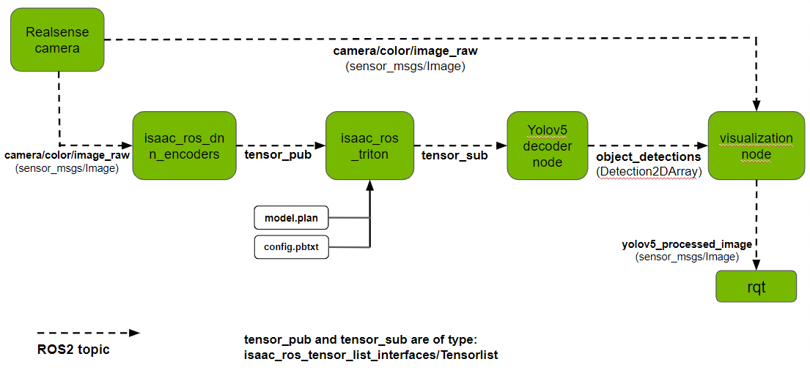

# YOLOv5 object detection with Isaac ROS

This is a sample showing how to integrate YOLOv5 with Nvidia [Isaac ROS DNN Inference](https://github.com/NVIDIA-ISAAC-ROS/isaac_ros_dnn_inference).

<p align="center" width="100%">

</p>

## Requirements

Tested on Jetson Orin running JetPack 5.0.2 and Intel RealSense D435 Webcam.
- [ROS2 Humble](https://docs.ros.org/en/humble/index.html)

## Development Environment Setup

Use the [Isaac ROS Dev Docker](https://github.com/NVIDIA-ISAAC-ROS/isaac_ros_dnn_inference#docker) for development. This provides an environment with all dependencies installed to run [Isaac ROS](https://github.com/NVIDIA-ISAAC-ROS) packages. 

## Usage 

Refer to the license terms for the YOLOv5 project before using this software and ensure you are using YOLOv5 under license terms compatible with your project requirements.

### Model preparation
- Download the YOLOv5 PyTorch model - [yolov5s.pt](https://github.com/ultralytics/yolov5/releases/download/v6.2/yolov5s.pt) from the [Ultralytics YOLOv5](https://github.com/ultralytics/yolov5) project.
- Export to ONNX following steps [here](https://github.com/ultralytics/yolov5/issues/251) and visualize the ONNX model using [Netron](https://netron.app/). Note `input` and `output` names - these will be used to run the node. For instance, `images` for input and `output0` for output. Also note input dimensions, for instance, `(1x3x640x640)`.


### Object Detection pipeline Setup
1. Following the development environment setup above, you should have a ROS2 workspace named `workspaces/isaac_ros-dev`. Clone this repository and its dependencies under `workspaces/isaac_ros-dev/src`:
```
cd ~/workspaces/isaac_ros-dev/src
git clone https://github.com/NVIDIA-ISAAC-ROS/isaac_ros_common.git
git clone https://github.com/NVIDIA-ISAAC-ROS/isaac_ros_nitros.git
git clone https://github.com/NVIDIA-ISAAC-ROS/isaac_ros_dnn_inference.git
git clone https://github.com/NVIDIA-ISAAC-ROS/isaac_ros_image_pipeline
git clone https://github.com/NVIDIA-AI-IOT/YOLOv5-with-Isaac-ROS.git
```
2. Download [requirements.txt](https://github.com/ultralytics/yolov5/blob/master/requirements.txt) from the Ultralytics YOLOv5 project to `workspaces/isaac_ros-dev/src`.
- Copy your ONNX model (say, `yolov5s.onnx`) from above to `workspaces/isaac_ros-dev/src`.
- Follow [Isaac ROS Realsense Setup](https://github.com/NVIDIA-ISAAC-ROS/.github/blob/main/profile/realsense-setup.md) to setup the camera.
- Launch the Docker container using the run_dev.sh script:
```
cd ~/workspaces/isaac_ros-dev/src/isaac_ros_common
./scripts/run_dev.sh
```
3. Inside the container, run the following: 
```
pip install -r src/requirements.txt
```
4. **Install Torchvision**: This project runs on a device with an Nvidia GPU. The Isaac ROS Dev container uses the Nvidia-built PyTorch version with CUDA-acceleration. Ensure that you install a compatible Torchvision version from source for CUDA-acceleration. Specify the compatible version in place of `$torchvision_tag` below:
```
git clone https://github.com/pytorch/vision.git
cd vision
git checkout $torchvision_tag
pip install -v .
```
5. Download the [utils](https://github.com/ultralytics/yolov5/tree/master/utils) folder from the Ultralytics YOLOv5 project and put it in the `yolov5_isaac_ros` folder of this repository.
Finally, your file structure should look like this (all files not shown here):
```
.
+- workspaces
   +- isaac_ros-dev
      +- src
         +- requirements.txt
         +- yolov5s.onnx
         +- isaac_ros_common
         +- YOLOv5-with-Isaac-ROS
            +- README
            +- launch
            +- images
            +- yolov5_isaac_ros
               +- utils
               +- Yolov5Decoder.py  
               +- Yolov5DecoderUtils.py    
```
Refer to the license terms for the YOLOv5 project before using this software and ensure you are using YOLOv5 under license terms compatible with your project requirements.

6. Make the following changes to `utils/general.py`, `utils/torch_utils.py` and `utils/metrics.py` after downloading utils from the Ultralytics YOLOv5 project:
   1. In the import statements, add `yolov5_isaac_ros` before `utils`. For instance - change `from utils.metrics import box_iou` to `from yolov5_isaac_ros.utils.metrics import box_iou`

<p align="center" width="100%">

</p>

### Running the pipeline with TensorRT inference node
1. Inside the container, build and source the workspace:
```
cd /workspaces/isaac_ros-dev
colcon build --symlink-install
source install/setup.bash
```
2. Launch the RealSense camera node as per step 7 [here](https://github.com/NVIDIA-ISAAC-ROS/isaac_ros_image_pipeline#quickstart):
`ros2 launch realsense2_camera rs_launch.py`
3. Verify that images are being published on `/camera/color/image_raw`. You could use [RQt](https://docs.ros.org/en/humble/Concepts/About-RQt.html)/[Foxglove](https://foxglove.dev/) for this or use this command in another terminal inside the container:
`ros2 topic echo /camera/color/image_raw`
4. In another terminal inside the container, run the `isaac_ros_yolov5_tensor_rt` launch file. This launches the DNN image encoder node, TensorRT inference node and YOLOv5 decoder node. It also launches a visualization script that shows results on RQt. Use the names noted above in [Model preparation](https://github.com/NVIDIA-AI-IOT/YOLOv5-with-Isaac-ROS#model-preparation) as `input_binding_names` and `output_binding_names` (for example, `images` for `input_binding_names` and `output0` for `output_binding_names`). Similarly, use the input dimensions noted above as `network_image_width` and `network_image_height`:
```
ros2 launch yolov5_isaac_ros isaac_ros_yolov5_tensor_rt.launch.py model_file_path:=/workspaces/isaac_ros-dev/src/yolov5s.onnx engine_file_path:=/workspaces/isaac_ros-dev/src/yolov5s.plan input_binding_names:=['images'] output_binding_names:=['output0'] network_image_width:=640 network_image_height:=640
```
5. For subsequent runs, use the following command as the engine file `yolov5s.plan` is generated and saved in `workspaces/isaac_ros-dev/src/` after running the command above:
```
ros2 launch yolov5_isaac_ros isaac_ros_yolov5_tensor_rt.launch.py engine_file_path:=/workspaces/isaac_ros-dev/src/yolov5s.plan input_binding_names:=['images'] output_binding_names:=['output0'] network_image_width:=640 network_image_height:=640  
```
6. You can also [modify parameters](https://github.com/NVIDIA-AI-IOT/YOLOv5-with-Isaac-ROS#modifying-detection-parameters) to the YOLOv5 decoder node.
7. The workflow is shown in the image above:
   - The DNN image encoder node subscribes to images from the RealSense camera node on topic `/camera/color/image_raw`.
   - It encodes each image into an [isaac_ros_tensor_list_interfaces/TensorList](https://github.com/NVIDIA-ISAAC-ROS/isaac_ros_common/blob/main/isaac_ros_tensor_list_interfaces/msg/TensorList.msg) message and publishes on topic `tensor_pub`.
   - The TensorRT node uses the given ONNX model/TensorRT engine and performs inference on the tensors coming from the encoder node. It publishes results as a isaac_ros_tensor_list_interfaces/TensorList message on topic `tensor_sub`.
   - The YOLOv5 decoder node does post-processing on these tensors to extract the following information for each detection in the image: (bounding box center X and Y coordinates, bounding box height and width, detection confidence score and object class). It publishes this information on topic `object_detections` as a [Detection2DArray](http://docs.ros.org/en/lunar/api/vision_msgs/html/msg/Detection2DArray.html) message. 
   - `isaac_ros_yolov5_visualizer.py` subscribes to topics `camera/color/image_raw` from the camera node and `object_detections` from the decoder node. It publishes images with the resulting bounding boxes on topic `yolov5_processed_image`.
   - On running the pipeline, an RQt window will pop up, where you can view `yolov5_processed_image`. These images will contain bounding boxes, object classes and detection scores around detected objects. You could also use Foxglove to view images on `yolov5_processed_image`.


### Using Triton inference node with TensorRT Backend

<p align="center" width="100%">

</p>

1. Convert the ONNX model (say, `yolov5s.onnx`) to a TensorRT plan file named `model.plan` using `trtexec`. To do this, run the following command from `/usr/src/tensorrt/bin` and save the generated file under `yolov5/1/` of this project. 
```
cd /usr/src/tensorrt/bin
./trtexec --onnx=yolov5s.onnx --saveEngine=<absolute-path-to-save-location>  --fp16
```
2. File structure should look like this (all files not shown here):
```
.
+- workspaces
   +- isaac_ros-dev
      +- src
         +- isaac_ros_common
         +- YOLOv5-with-Isaac-ROS
            +- README
            +- launch
            +- yolov5
               +- config.pbtxt
               +- 1
                  +- model.plan
```

3. To launch the pipeline using Triton for inference (specify `network_image_width` and `network_image_height` as explained for the TensorRT node above): 
```
ros2 launch yolov5_isaac_ros isaac_ros_yolov5_triton.launch.py network_image_width:=640 network_image_height:=640
```

Visit [Isaac ROS DNN Inference](https://github.com/NVIDIA-ISAAC-ROS/isaac_ros_dnn_inference) for more information about the Image encoder, TensorRT and Triton nodes.

## Modifying detection parameters
Parameters like the confidence threshold can be specified in the `decoder_params.yaml` file under the `yolov5-isaac-ros-dnn/config` folder. Below is a description of each parameter:
- conf_thres: Detection confidence threshold
- iou_thres: IOU threshold
- max_det: Maximum number of detections per image

## Support
Please reach out regarding issues and suggestions [here](https://github.com/NVIDIA-AI-IOT/YOLOv5-with-Isaac-ROS/issues).
